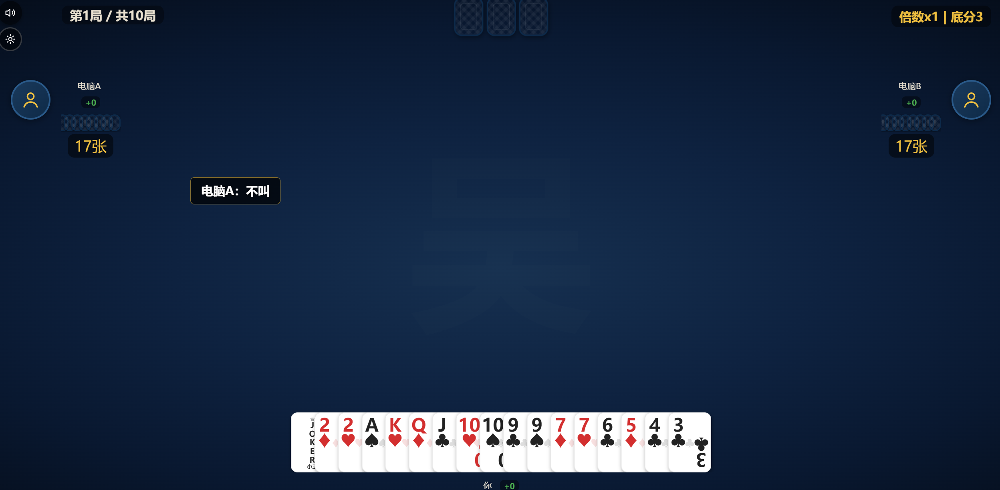
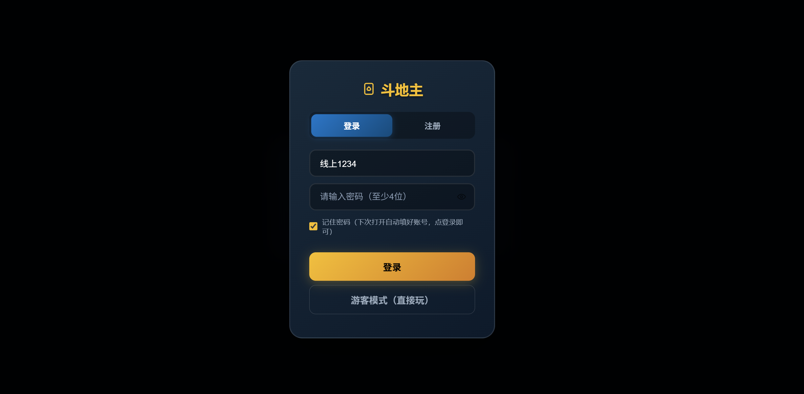
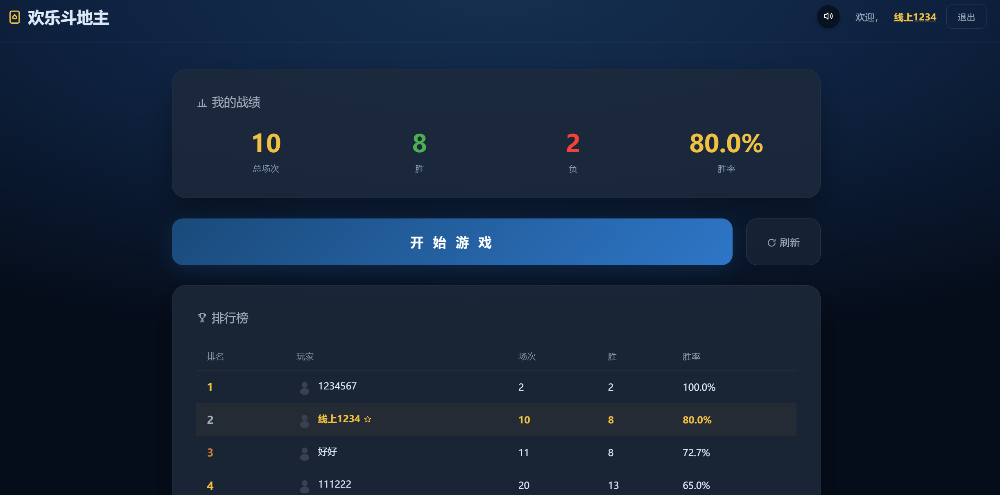

<p align="center">
  
</p>

<h1 align="center">斗地主终极版（会会斗地主）</h1>

<p align="center">
  
  
  
  
  
</p>

一个**全栈网页版斗地主游戏**：原生 JS 前端 + Flask 后端 + Python 启发式 AI 引擎，支持账号系统、战绩回放、排行榜与基于真实对局数据的 AI 学习闭环，Docker 容器化部署在腾讯云 CloudBase。

- 🔗 在线演示：https://doudizhu-game-294184-6-1420872702.sh.run.tcloudbase.com

---

## 目录

- [项目起源](#项目起源)
- [界面预览](#界面预览)
- [功能特性](#功能特性)
- [技术栈](#技术栈)
- [架构](#架构)
- [项目结构](#项目结构)
- [本地运行](#本地运行)
- [部署](#部署)
- [质量保障](#质量保障)
- [路线图](#路线图)
- [License](#license)

---

## 项目起源

家里长辈退休后想玩斗地主，但市面上的 App 广告多、需要充值、操作复杂。于是做了一个**免费、无广告、打开网页就能玩**的版本，给长辈用手机号注册即可开局。后来逐步迭代出多策略 AI 对战、用户系统、战绩回放，直至云端部署与 AI 学习闭环。

## 界面预览

登录、大厅与对战的三个核心界面：

对战、登录与大厅三个核心界面（顶部的对战图为叫牌阶段，进入出牌后 AI 会依据下方「AI 策略六要点」决策，配合角色分工与学习闭环持续进化）：

| 登录界面 | 大厅（战绩 / 排行榜） |
|---|---|
|  |  |

## 功能特性

| 功能 | 说明 |
|---|---|
| AI 对战 | 三个 AI 对手（地主 / 门板农民 / 下家农民），具备手数分析、拆牌罚分、让牌三原则、概率记牌推算等策略，非随机出牌 |
| 农民配合 | 门板顶牌、下家冲锋的角色分工；不压队友红线（浪费压制=0） |
| AI 学习闭环 | 每局按"分桶"记录关键决策与结果写入数据库，样本量达门槛后以 ±20 分修正影响后续决策——**变的是数据，不是代码** |
| 用户系统 | 注册 / 登录 / 自动登录 / 注销、头像上传、隐私开关 |
| 战绩与回放 | 保存每局完整操作序列，支持逐步回放复盘 |
| 排行榜 | 多用户胜场 / 胜率排行（用户名做 HTML 转义防 XSS） |
| 响应式 | 适配电脑与手机（含横屏），回放界面有独立移动端缩放 |
| 音效 | 背景音乐 + 出牌语音（"单勾""对圈""大王"等）+ 炸弹倍数提示 |

## 技术栈

| 层 | 技术 | 规模 |
|---|---|---|
| 前端 | 原生 HTML/CSS/JS，无框架，按功能分 8 组 26 个模块 | ~2,600 行 JS |
| 后端 | Python 3 + Flask + Blueprint（auth / user / game_data / ai / static 5 组路由） | ~1,400 行 |
| AI 引擎 | 纯 Python 决策引擎（评估 / 策略 / 候选生成 / 门板成本模型 / 队友模型 / 学习修正） | ~4,400 行 |
| 数据库 | 生产：腾讯云 TDSQL-C MySQL；本地：自动降级 SQLite（双模式，凭据全部环境变量注入） | 3 张核心表 |
| 部署 | Docker + CloudBase 云托管 + GitHub Actions CI/CD | 推送即部署 |

## 架构

```
浏览器（frontend/js 26模块）
   │  fetch /api/*
   ▼
Flask 后端（backend/app.py + routes/）
   │  出牌决策
   ▼
AI 引擎（backend/ai/）
   ├─ engine.py        决策总入口（统一评分候选出牌）
   ├─ evaluation.py    手牌评估 / 概率记牌推算（只看公开信息，不看暗手）
   ├─ strategy.py      出牌策略与让牌三原则
   ├─ candidates.py    候选牌型生成
   ├─ gate_cost.py     门板顶牌成本模型
   ├─ partner_model.py 队友配合模型（送牌/渡牌/接队友）
   ├─ bid.py           叫/抢地主决策
   ├─ learning.py      学习闭环：分桶记录 + 查账修正（±20）
   └─ state.py/pattern.py/config.json
   │
   ▼
MySQL（TDSQL-C，环境变量注入凭据）/ SQLite（本地自动降级）
   ├─ users          账号
   ├─ game_records   战绩 + 完整操作序列（回放数据源）
   └─ ai_learning    决策分桶账本（学习数据源）
```

### AI 策略六要点

1. **手数分析**：估算打完剩余手牌的最少回合数，优先走出牌后手数更少的方案
2. **拆牌罚分层级**：拆顺子/连对按代价分级罚分，不破坏关键牌型
3. **禁用大牌当带牌**：2 和王不做三带/四带的 kicker，保留控制力
4. **让牌三原则**：位置（是否队友先出）、牌型（能否便宜接）、代价（让完是否失控）
5. **概率记牌推算**：基于已出牌与对手剩余张数推算持牌概率——不读暗手，公平可解释
6. **角色分工**：门板农民顶住地主、下家农民冲锋跑牌；红线是绝不浪费压制队友

### 学习闭环（数据驱动，不改代码）

```
每局决策 → 按局面分桶写入 ai_learning（BID/PASS/COUNTER/SPLIT/BOMB…）
        → 某桶样本 ≥30 条 → 查账员按桶胜率给候选 ±20 分修正
        → 60 秒缓存刷新，AI 行为随真实战绩缓慢演化
```

## 项目结构

```
├── backend/
│   ├── app.py              # Flask 入口：建表、诊断接口 /api/diag
│   ├── utils.py            # 数据库双模式连接（MySQL/SQLite 自动降级）
│   ├── routes/             # 5 组 Blueprint：auth / user / game_data / ai / static
│   └── ai/                 # AI 引擎（10 个模块，见上方架构图）
├── frontend/
│   ├── index.html          # 游戏主界面
│   ├── lobby.html          # 大厅：登录、排行榜、回放入口
│   ├── sound.js / style.css / manifest.json
│   └── js/
│       ├── 01-core/        # 常量、状态、牌型识别
│       ├── 02-game/        # 发牌、叫地主、出牌、结算
│       ├── 03-ai/          # 前端 AI 兜底与后端调用
│       ├── 04-replay/      # 回放控制与渲染
│       ├── 05-ui/          # 卡牌渲染、布局、交互
│       ├── 06-user/        # 登录注册、战绩、排行榜
│       ├── 07-audio/       # 音效控制
│       └── 99-init/        # 启动装配
├── audio/                  # 背景音乐与出牌语音
├── assets/screenshots/     # README 界面预览截图
├── .github/workflows/deploy.yml  # push main → 自动构建部署到 CloudBase
├── Dockerfile              # python:3.11-slim + Flask
├── requirements.txt        # flask / flask-cors / gunicorn / Pillow / pymysql
└── 启动斗地主.bat          # Windows 一键本地启动
```

## 本地运行

```bash
# 1. 安装依赖（Python 3.10+）
pip install -r requirements.txt

# 2. 启动（默认 8080 端口）
cd backend
python app.py

# 3. 浏览器访问 http://localhost:8080
#    Windows 用户也可直接双击项目根目录的「启动斗地主.bat」
```

无需配置数据库：检测不到 MySQL 凭据时自动降级为本地 SQLite（`backend/database/doudizhu.db`），本地数据与线上数据完全隔离。

连接生产 MySQL 需注入环境变量：`DB_HOST / DB_PORT / DB_USER / DB_PASSWORD / DB_NAME`（凭据不入库，在 CloudBase 云托管服务设置中配置）。

## 部署

```
git push origin main
   → GitHub Actions 读取 Secrets（TCB_SECRET_ID / TCB_SECRET_KEY / TCB_ENV_ID）
   → tcb CLI 构建 Docker 镜像并部署到 CloudBase 云托管
   → 约 2 分钟生效，访问 GET /api/diag 验证（db_mode=mysql, db_ok=true）
```

## 质量保障

- 行为回归基线（quality gate）：500 局自动对拍 + 关键决策快照比对，任何策略改动必须过门
- 红线探针：浪费压队友 / 炸弹压队友 / 乱炸 三项恒为 0 的纪律断言
- 真人实测：策略迭代以真实对局回放对账定案

## 路线图

- [ ] 用户密码 bcrypt 化（当前 SHA-256）
- [ ] 统一鉴权中间件与 API 测试覆盖
- [ ] 学习数据真人/模拟分账
- [ ] 社交功能：好友、他人主页与最近对局回放

---

## License

[MIT License](LICENSE) © 2026 James Wu
